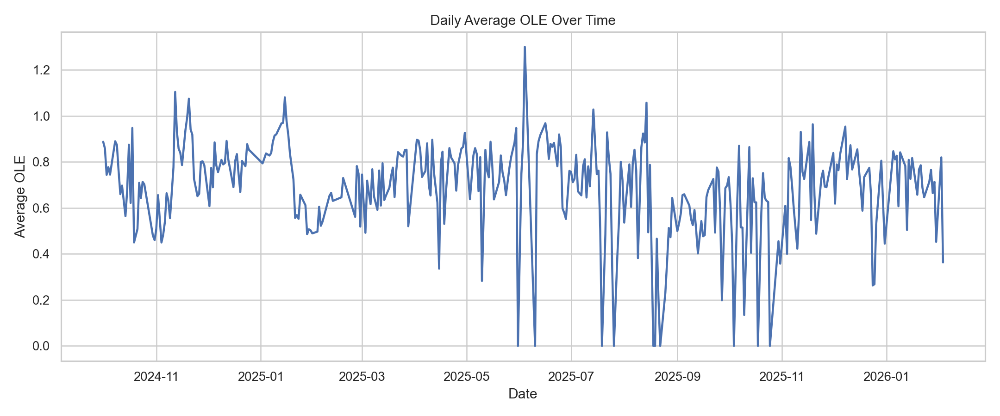
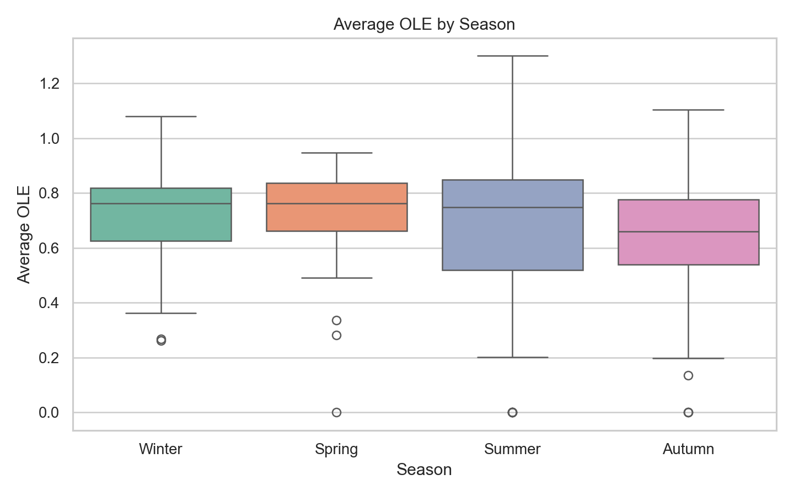
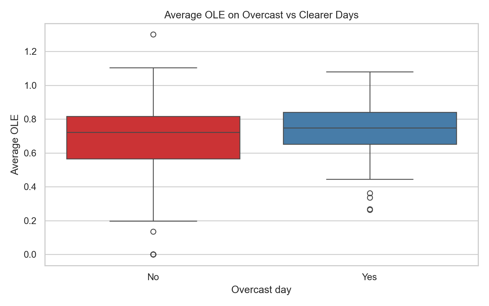
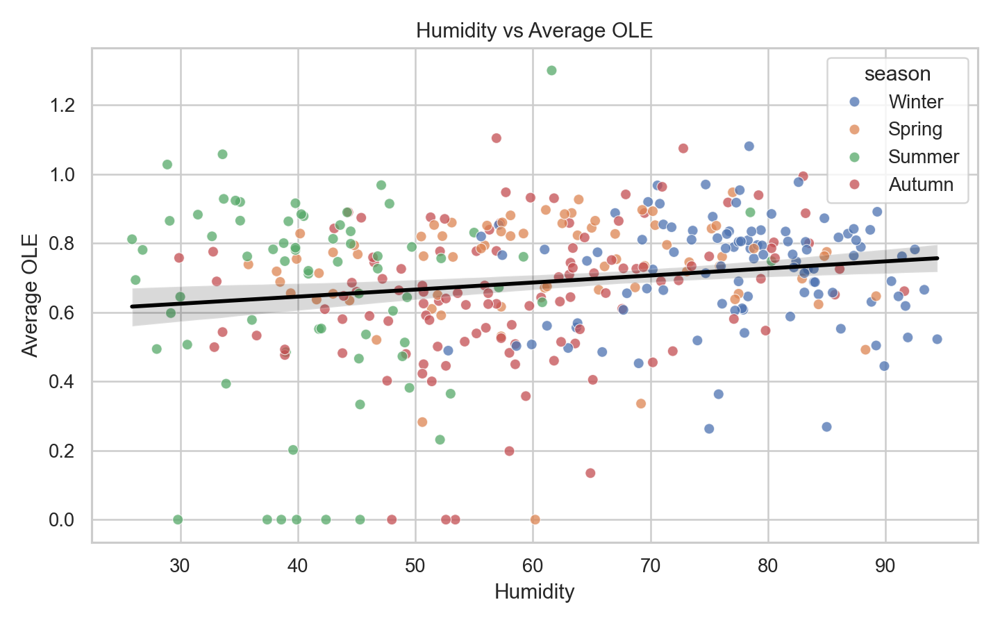

# DSA210-TermProject
# From Weather to Errors: Understanding Production Performance

## Project Overview

This project investigates whether daily weather conditions in Kayseri are associated with production performance in a climate-controlled factory environment. Even though workers are not directly exposed to outdoor conditions during production, weather may still influence performance indirectly through mood, motivation, commute difficulty, or general behavioral patterns.

The main goal is to examine whether weather variables such as temperature, precipitation, humidity, and cloud cover have a measurable relationship with production efficiency, failure rates, and downtime.

## Research Question

Does weather have a statistically significant relationship with factory production performance?

## Hypothesis

The central hypothesis of this project is that weather conditions can affect production outcomes indirectly through psychological and behavioral channels.

- `H0`: Weather conditions do not have a significant relationship with production performance.
- `H1`: Weather conditions have a significant relationship with production performance.

More specific sub-hypotheses tested in this project:

- Rainy days may lead to lower OLE or higher failure rates.
- Overcast days may affect worker performance differently than clearer days.
- Production performance may vary across seasons.

## Dataset

This project combines two different datasets:

### 1. Production Dataset

The production dataset comes from a real Turkish white goods manufacturer in Kayseri. It contains hourly line-level production observations.

Main variables:

- `OLE` (Overall Line Efficiency)
- `Üretim Adeti` (production quantity)
- `Arıza Adeti` (failure count)
- `Plansız Duruşlar (Dk)` (unplanned downtime)
- `Kişi Sayısı` (worker count)

### 2. Weather Dataset

The weather dataset contains historical daily weather records for Kayseri between `2024-10-01` and `2026-02-03`.

Main variables:

- Temperature
- Humidity
- Precipitation
- Cloud cover
- Wind speed
- Solar radiation
- Weather condition labels

## Data Preprocessing

The raw production data was cleaned and aggregated from hourly format to daily format. Blank footer rows and non-observation rows were removed by keeping only rows with valid date and time values.

After preprocessing:

- Hourly observations after cleaning: `7,760`
- Daily merged observations: `361`
- Date range used in the final analysis: `2024-10-01` to `2026-02-03`

The final daily dataset includes:

- Daily average OLE
- Daily total production
- Daily total failure count
- Daily failure rate
- Daily downtime per hour
- Daily average worker count
- Daily weather indicators

## Exploratory Data Analysis

The exploratory analysis focused on how production metrics change over time, across seasons, and under different weather conditions.

### Key Summary Statistics

- Mean daily OLE: `0.6889`
- Mean daily failure rate: `0.0182`
- Mean downtime per hour: `8.28` minutes

### EDA Visualizations

#### Daily OLE Over Time

#### OLE by Season

#### OLE on Overcast vs Clearer Days

#### Humidity vs OLE

## Statistical Analysis

The project uses:

- Spearman correlation analysis
- Welch's t-test
- Mann-Whitney U test
- One-way ANOVA
- Kruskal-Wallis test
- OLS regression with robust standard errors

## Main Findings

### 1. Rainy vs Non-Rainy Days

Rainy days did **not** produce a statistically significant difference in OLE or failure rate.

- Rainy vs non-rainy OLE: `p = 0.5592`
- Rainy vs non-rainy failure rate: `p = 0.4698`

This means rainfall alone does not appear to have a strong direct effect on production performance in this dataset.

### 2. Overcast Days

Overcast days showed a significant difference in OLE in the simple group comparison.

- Overcast-day mean OLE: `0.7301`
- Clearer-day mean OLE: `0.6733`
- Welch's t-test: `p = 0.0065`
- Mann-Whitney U: `p = 0.0394`

However, this effect became statistically insignificant after controlling for season and worker count in regression analysis. This suggests that the apparent cloud-cover effect may partly reflect broader seasonal or operational differences.

### 3. Seasonal Differences

Seasonal variation is one of the strongest findings in the project.

Average OLE by season:

- Winter: `0.7210`
- Spring: `0.7340`
- Summer: `0.6585`
- Autumn: `0.6513`

Seasonal tests show statistically significant differences for:

- `OLE` with `ANOVA p = 0.0072`
- `Failure rate` with `ANOVA p = 0.0103`

Downtime differences across seasons were not statistically significant.

### 4. Correlation Results

The strongest weather-related correlations were weak but statistically significant:

- Humidity vs OLE: `rho = 0.1418`, `p = 0.0070`
- Cloud cover vs OLE: `rho = 0.1173`, `p = 0.0258`

These results suggest that weather-related variables may contribute to daily variation, but they explain only a limited portion of overall production performance.

## Regression Insight

An OLS regression model was estimated to test whether weather variables still matter after controlling for season and workforce size.

Model:

`avg_ole ~ temperature + precipitation + cloud cover + humidity + average workers + season`

Results:

- Humidity remained statistically significant.
- Average worker count had a strong positive relationship with OLE.
- Cloud cover lost significance after controls were added.
- Model `R² = 0.275`

This indicates that some of the raw weather effects are mixed with operational structure, especially staffing and seasonal patterns.

